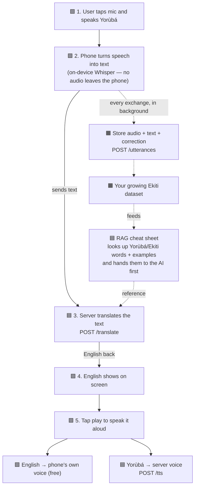

# Afara — How the System Works

A map of how one spoken sentence travels through Afara, and where every piece
lives. Read this if the pipeline feels confusing.

The core idea: **the phone does the listening, the server does the thinking.**

- 🟩 **PHONE** = runs in the mobile app (frontend)
- 🟦 **SERVER** = runs in the backend (this repo)
- 🟧 **DATASET** = the recordings we keep — the moat

---

## The flow (Yorùbá → English)



If the diagram above doesn't render, here's the same thing in plain steps:

```
PHONE   1. User speaks Yorùbá
PHONE   2. Phone transcribes it to text (on-device Whisper)
              |  sends text
SERVER  3. /translate  ->  AI returns English
              ^  RAG looks up Ekiti words and feeds them to the AI first
SERVER      (translation sent back)
PHONE   4. English appears on screen
PHONE   5. Tap play:
              English  -> phone's built-in voice (free, offline)
              Yoruba   -> /tts on the server (phones have no Yoruba voice)

BACKGROUND (every exchange):
              /utterances -> store audio + text + correction -> Ekiti dataset -> feeds RAG
```

---

## What RAG is (in plain words)

RAG = giving the AI a **cheat sheet** right before it answers.

Instead of training a whole new AI for Ekiti (slow, expensive, needs data we
don't have yet), the server keeps a searchable list of Yorùbá/Ekiti words,
meanings, and example translations. When a sentence comes in, it looks up the
relevant entries and hands them to the AI as reference. The AI "reads the cheat
sheet," then answers.

**This is how we handle Ekiti today, with no trained Ekiti model.** It lives on
the **server** — the phone doesn't do any of it.

The cheat sheet starts from the **MENYO-20k** dataset (standard Yorùbá↔English,
~20,000 sentence pairs) and **grows every time a user corrects the app.**

> ⚠️ MENYO-20k is *Standard* Yorùbá, not Ekiti. It makes the app good at general
> Yorùbá. The **Ekiti** part only comes from corrections our own users feed in
> via `/utterances`. So: MENYO gives the baseline, our data makes it Ekiti.

---

## The dataset builder — the moat

Separately from everything above, each real exchange (audio clip + what was said
+ any correction) is uploaded and stored. Over time this becomes the **first
Ekiti-Yorùbá dataset that exists** — something no one else has, and the reason
Afara can eventually beat the generic tools.

```
POST /utterances -> store audio + text + correction
                 -> feeds the RAG cheat sheet now
                 -> trains a real Ekiti model later
```

---

## The Ekiti plan — three stages, not one

| When | Stage | What it means |
|------|-------|---------------|
| **Now** | RAG cheat sheet | Give a general AI a lookup of Yorùbá/Ekiti words. Works immediately, no training. |
| **As users use it** | The sheet grows | Every correction gets added. The app measurably improves at Ekiti — and we can show it. |
| **Later** | Train a real model | Once enough Ekiti data is collected, fine-tune an actual model. This is what investors fund. |

Ekiti isn't a dead end — it's a staircase. RAG gets us standing today; the data
flywheel climbs us up.

---

## The endpoints, mapped to the flow

| Endpoint | Where | Does what | Status |
|----------|-------|-----------|--------|
| `POST /translate` | Server | Text in → translation out (the hot path) | placeholder until AI key added |
| `POST /tts` | Server | Text → Yorùbá voice (English handled by phone) | placeholder |
| `POST /companion/chat` | Server | The AI tutor / chat feature | placeholder |
| `POST /utterances` | Server | Stores the recordings → builds the dataset | **live & real** |
| `GET /health`, `GET /languages` | Server | Plumbing | live |

Everything marked "placeholder" turns real the moment an AI key is added — one
setting, no code changes.

---

## Two things to settle before this is a real product

1. **Licensing.** Both the likely dataset (`MENYO-20k`) and the Yorùbá voice
   model (`mms-tts-yor`) are licensed **non-commercial**. Fine for a demo, but a
   paid product needs commercially-cleared data and voices.
2. **Where the models get hosted / who pays.** STT is on the phone (decided).
   Translation + tutor = server AI (needs an API key). Yorùbá TTS = server.
